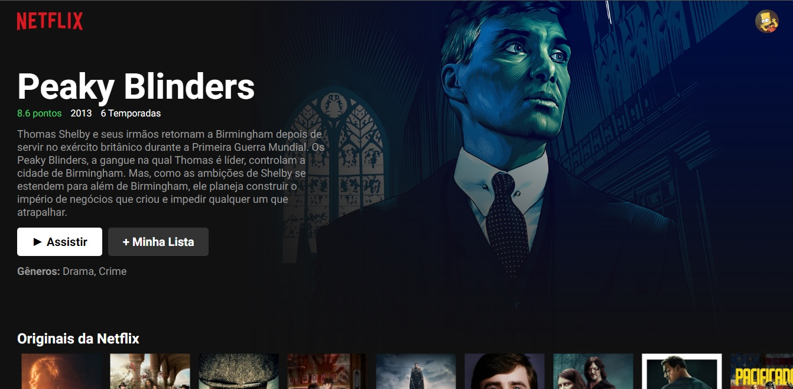

# Getting Started with Create React App 

  

 Clone da Interface da Netflix com ReactJS para fins de aprendizagem e aperfeiçoamento 
com foco nas Request API 

  

  

# API -> `https://www.themoviedb.org/settings/api` (The Movie DB)  
# Lib -> `material-ui/icons` 

### 🌌 Tecnologias 🌌

- Typescript
- ReactJs
- NextJs

## Author

👤 **Patrick Anjos**

* Github: [@setxpro](https://github.com/setxpro)

## Under construction to the next level 🚀 
